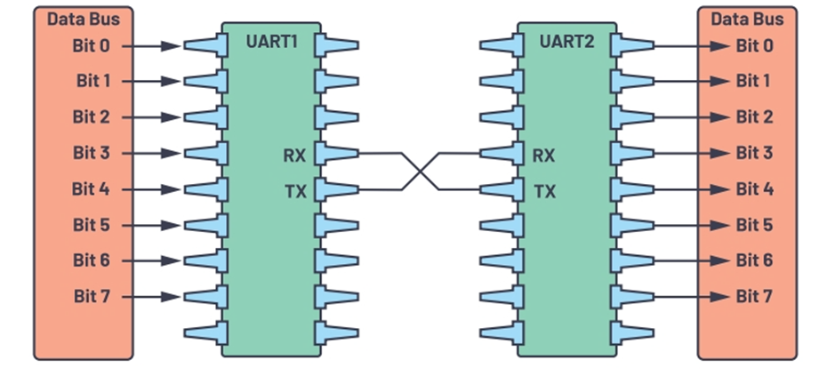
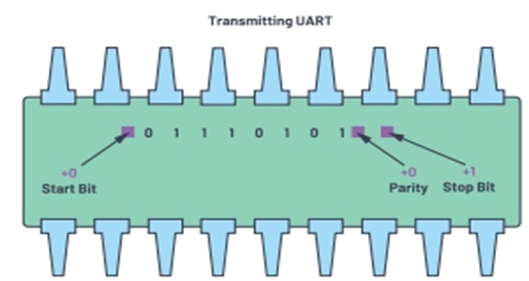

# UART  

## Que es y como funciona  

UART (Universal Asynchronous Transmitter Receiver) Es un protocolo que permiten que dos o más microcontroladores se comuniquen entre sí y transmitan información. Diseñado para realizar una comunicación asíncrona. Este dispositivo envía y recibe datos de un sistema a otro.  El UART tiene 2 líneas de datos entre el transmisor y receptor para transmitir y recibir en ambas direcciones.

La comunicación UART involucra dos componentes principales: un transmisor (Tx) y un receptor (Rx). La función para la transmisión es convertir los datos paralelos a serie mientras la recepción convierte los datos serie a paralelos.

Para implementar la comunicación en serie, se requieren un origen y un destino. También se les conoce como emisor y receptor. Se pueden emplear varios tipos de comunicación serie y se designan como Simplex, Half Duplex y Full Duplex.

- El método Simplex implementa la transmisión de datos unidireccional. Solo el origen o el destino están activos en un momento dado.
- Modo Half Duplex permite que el origen y el destino estén activos, pero no simultáneamente. La transmisión solo ocurre en una dirección a la vez.
- odo Full Duplex es la forma de comunicación serie más utilizada en el mundo. El origen y el destino están activos y pueden enviar y recibir datos simultáneamente.

### Interfaz serie sincrónica

Una interfaz serie sincrónica utiliza un solo bus de CPU que comparte la señal del reloj y la transmisión de datos.

### Interfaz serie asincrónica

Una interfaz serie asíncrona funciona sin una señal de reloj externa.

Una de las grandes ventajas del UART es que es asíncrono: el transmisor y el receptor no comparten una señal de reloj común. Dado que no comparten un reloj, ambos terminales deben transmitir a la misma velocidad preestablecida para que tengan la misma sincronización de bits.

- Baudios: Periodo de comunicación.
- Bps: bits por segundo.
- 1 baudio = 1 bit por segundo.  

Las velocidades de baudios del UART más comunes que se utilizan en estos días son:

- 2,400
- 9,600
- 19,200
- 38,400
- 57,600
- 115,200

### Bits de inicio y parada

La comunicación UART emplea bits de inicio y parada. La trama de datos generalmente consta de un bit de inicio, bits de datos (generalmente 8 bits), un bit de paridad opcional para la verificación de errores y uno o más bits de parada.

Durante la transmisión de datos, el bit de inicio señala el comienzo de una trama de datos y el receptor se sincroniza con esta señal. Los bits de datos llevan la información real que se va a transmitir, y el bit de paridad opcional ayuda en la detección de errores. Finalmente, el bit o bits de parada señalan el final de la trama de datos. 
Cuando el bit de paridad coincide con los datos, el UART sabe que la transmisión estuvo libre de errores. Pero si el bit de paridad es un 0 y el total es impar, o el bit de paridad es un 1 y el total es par, el UART sabe que los bits en el paquete de datos han cambiado.

## Impliementación en PIC18F45K50  

El PIC seleccionado cuenta con un modulo EUSART (Enhanced Universal Synchronous Asynchronous Receiver Transmitter) por lo que se podra trabajar en modo asincrono o sincrono.

La operacion del modulo EUSART es controlada por 3 registros  

- Transmit Status and Control (TXSTAx)
- Receive Status and Control (RCSTAx)
- Baud Rate Control (BAUDCONx)  

---

### Configuracion de transmision Asincrona

Segun el propio datasheet. Estos son los pasos para realizar una transmision asincrona:

> 1. Inicialice el par de registros SPBRGHx:SPBRGx y los bits BRGH y BRG16 para lograr la tasa de baudios deseada.
> 2. Establezca los controles TRIS RX/DT y TX/CK en '1'.
> 3. Habilite el puerto serie asíncrono borrando el bit SYNC y configurando el bit SPEN.
> 4. Si se desea una transmisión de 9 bits, establezca el bit de control TX9. Un noveno bit de datos establecido indicará que los ocho bits de datos menos significativos son una dirección cuando el receptor esté configurado para la detección de direcciones.
> 5. Establezca el bit de control TXCKP si se desea una polaridad de datos de transmisión invertida.
> 6. Habilite la transmisión configurando el bit de control TXEN. Esto hará que se active el bit de interrupción TXIF.
> 7. Si se desean interrupciones, establezca el bit de habilitación de interrupción TXIE. Se producirá una interrupción de inmediato siempre que los bits GIE/GIEH y PEIE/GIEL del registro INTCON también estén configurados.
> 8. Si se selecciona la transmisión de 9 bits, el noveno bit debe ser cargado en el bit de datos TX9D.
> 9. Cargue datos de 8 bits en el registro TXREGx. Esto iniciará la transmisión.  

#### 1 - Configurar los baudios

Los registros que se usaran son:

- TXSTA1:  
  - SYNC: Selecciona el modo del EUSART  
    1 = Sincrono  
    ***0 = Asincrono***  
    - Por ahora solo lo haremos asincrono
  - BRGH: Selecciona si sera un rango alto de baudios. Solo con asincrono  
  ***1 = High speed***  
  0 = Low speed  
    - Se selecciona alta velocidad para mejorar el funcionamiento con el reloj de 48MHz  
- BAUDCON1:
  - BRG16: Selecciona si el generador de baudrate usara 8 o 16 bits  
  ***1 = 16-bit Baud Rate Generator is used (SPBRGHx:SPBRGx)***  
  0 = 8-bit Baud Rate Generator is used (SPBRGx)
    - Se seleccionaran 16bits para disminuir el error  

Con esta configuracion podemos configurar los baudios entre los mas utilizados cambiando el valor de SPBRGHx:SPBRGx segun la siguiente tabla

| BR esperado | BR Real | % Error | SPBRGHx:SPBRGx |
| -- | -- | -- | -- |
| 300 | 300 | 0.00 | 39999 |
| 1200 | 1200 | 0.00 | 9999 |
| 2400 | 2400 | 0.00 | 4999 |
| 9600 | 9600 | 0.00 | 1249 |
| 10417 | 10417 | 0.00 | 1151 |
| 19.2k | 19.2k | 0.00 | 624 |
| 57.6k | 57.69k | 0.16 | 207 |
| 115.2k | 115.39k | 0.16 | 103 |

#### 2 - Configurar pines como tri-estado

Simplemente se aplican a los correspondientes registros TRIS un 1  

- TRISC:  
  - R6: PORTC Tri-State Control bit  
    ***1 = PORTx pin configured as an input (tri-stated)***  
    0 = PORTx pin configured as an output
    - Se coloca como tri estado para el pin Tx
  - R7: PORTC Tri-State Control bit  
    ***1 = PORTx pin configured as an input (tri-stated)***  
    0 = PORTx pin configured as an output
    - Se coloca como tri estado para el pin Rx

#### 3 - Habilitacion del puerto serie  

El registro SYNC ya fue ajustado en el paso 1.  

- RCSTA:  
  - SPEN: Bit de habilitacion de puerto serial  
    ***1 = Puesto serial es habilitado***  
    0 = Puesto serial es deshabilitado
    - Los pines RX/DT y TX/CK seran usados como pines seriales  

#### 4 - 9bits  

Estas funcion si bien podemos agregarla en un futuro. Por el momento no sera inplementada.

#### 5 - Inversion de polaridad

No implementada  

#### 6 - Habilitar transmision  

- TXSTA:  
  - TXEN: Bit de habilitacion transmision  
    ***1 = Transmision habilitada***  
    0 = Transmision deshabilitada

#### 7 - Interrupcciones

No implementado

#### 8 - Carga bit 9

No implementado

#### 9 - Carga de dato  

Aqui solante se trata de cargar el dato a TXREG1 que lo pasara paralelamente a TSR (Transmit Shift Register). El cual pasara los datos hacia el pin de forma serial.  
Si bien no esta especificado en las instrucciones anteriores se agregara una pequeña funcion con el registro TRMT. Este estara en 0 mientras aun haya datos pendientes en TSR.

### Configuración de Recepción Asincrónica  

Segun el propio datasheet. Estos son los pasos para realizar una recepcion asincrona:

> 1. Inicialice el par de registros SPBRGHx:SPBRGx y los bits BRGH y BRG16 para lograr la tasa de baudios deseada.
> 2. Establezca los controles TRIS de RX/DT y TX/CK en '1'.
> 3. Habilite el puerto serie configurando el bit SPEN y el bit TRIS del pin RX/DT. El bit SYNC debe estar en cero para el funcionamiento asíncrono.
> 4. Si se desean interrupciones, configure el bit de habilitación de interrupciones RCIE y ajuste los bits GIE/GIEH y PEIE/GIEL del registro INTCON.
> 5. Si se desea recepción de 9 bits, configure el bit RX9.
> 6. Establezca el RXDTP si se desea polaridad de recepción invertida.
> 7. Habilite la recepción configurando el bit CREN.
> 8. El bit de bandera de interrupción RCIF se establecerá cuando un carácter se transfiera del RSR al búfer de recepción. Se generará una interrupción si también se ha activado el bit de habilitación de interrupción RCIE.
> 9. Lea el registro RCSTAx para obtener las banderas de error y, si la recepción de datos de 9 bits está habilitada, el noveno bit de datos.
> 10. Obtenga los ocho bits de datos menos significativos recibidos del búfer de recepción leyendo el registro RCREGx.
> 11. Si ocurrió un desbordamiento, borre la bandera OERR desactivando el bit de habilitación del receptor CREN.  

Como se ve, hasta el paso 6 es lo mismo para la transmision, asi que lo obviaremos.

#### 7 - Habilitar recepcion

- RCSTA:  
  - CREN: Bit de habilitacion recepcion continua  
    ***1 = Recepcion habilitada***  
    0 = Recepcion deshabilitada  

#### 8 - Revisar bandera

- PIR1:  
  - RCIF: EUSART Receive Interrupt Flag bit  
    1 = The EUSART receive buffer, RCREG1, is full (cleared when RCREG1 is read)  
    0 = The EUSART receive buffer is empty
bit 4 TXIF: EUSART Transmit Interrupt Flag bit

Se va a leer el registro, cuando este tenga 1 significa que hay un dato esperando a ser leido.

#### 9 - Leer errores

- RCSTA:  
  - FERR: Framing Error bit  
  1 = Framing error (can be updated by reading   RCREGx register and receive next valid byte)  
  0 = No framing error
    - Este error es ocacionado cuando no se detecta correctamente el bit de parada, lo que significa un descordinamiento.
  - OERR: Overrun Error bit  
  1 = Overrun error (can be cleared by clearing bit CREN)  
  0 = No overrun error
    - Este error es ocacionado cuando se llena el buffer de datos y no se leyeron antes de llegar mas

#### 10 - Leer dato

Para obtener el dato siemplemente hay que leer el registro RCREG1

#### 11 - Borrar error de desbordamiento

Para borrar el registro de OERR hay que dehabilitar y volver a habilitar CREN